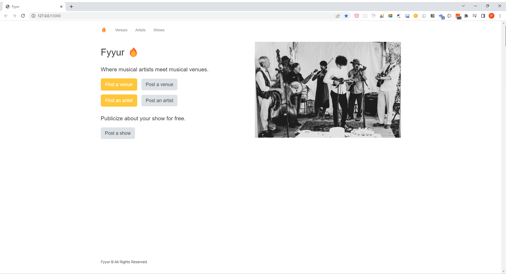

# Fyyur

> Fyyur is a musical venue and artist booking site that facilitates the discovery and bookings of shows between local performing artists and venues. This site lets you list new artists and venues, discover them, and list shows with artists as a venue owner.


## Fyyur demo




## Overview

The application showcases the following features:

* creating new venues, artists, and creating new shows.
* searching for venues and artists.
* learning more about a specific artist or venue.
* Object-oriented thinking in Python, including abstract classes, class methods, and static methods.
* DRY (don't repeat yourself) principles of class and method design.
* Working with modules and packages in Python.
* Coding best practices for style and documentation
* Ensuring that code, docstrings, and comments adhere to [PEP 8 Standards](https://www.python.org/dev/peps/pep-0008/).


## Tech Stack (Dependencies)

### 1. Backend Dependencies
The tech stack includes the following:
 * **virtualenv** as a tool to create isolated Python environments
 * **SQLAlchemy ORM** to be our ORM library of choice
 * **PostgreSQL** as our database of choice
 * **Python3** and **Flask** as our server language and server framework
 * **Flask-Migrate** for creating and running schema migrations
You can download and install the dependencies mentioned above using `pip` as:
```
pip install virtualenv
pip install SQLAlchemy
pip install postgres
pip install Flask
pip install Flask-Migrate
```

### 2. Frontend Dependencies
You must have the **HTML**, **CSS**, and **Javascript** with [Bootstrap 3](https://getbootstrap.com/docs/3.4/customize/) for our website's frontend. Bootstrap can only be installed by Node Package Manager (NPM). Therefore, if not already, download and install the [Node.js](https://nodejs.org/en/download/). Windows users must run the executable as an Administrator, and restart the computer after installation. After successfully installing the Node, verify the installation as shown below.
```
node -v
npm -v
```
Install [Bootstrap 3](https://getbootstrap.com/docs/3.3/getting-started/) for the website's frontend:
```
npm init -y
npm install bootstrap@3
```


## Main Files: Project Structure

  ```sh
  ├── README.md
  ├── app.py *** the main driver of the app. Includes your SQLAlchemy models.
                    "python app.py" to run after installing dependencies
  ├── config.py *** Database URLs, CSRF generation, etc
  ├── models.py *** Database Models
  ├── utils.py *** Project Utilities
  ├── error.log
  ├── forms.py *** Your forms
  ├── requirements.txt *** The dependencies we need to install with "pip3 install -r requirements.txt"
  ├── static
  │   ├── css 
  │   ├── font
  │   ├── ico
  │   ├── img
  │   └── js
  └── templates
      ├── errors
      ├── forms
      ├── layouts
      └── pages
  ```


## Installation

### Requirements
The project requires `pip` installed.

If you do not have `pip` installed, you can download it here: [pip](https://pip.pypa.io/en/stable/installing/)

### Setup

1. **Create an empty database (fyyurDB) in postgres locally:
```sh
$ createdb -U postgres fyyurDB
```

2. **Clone the source locally:
```sh
$ git clone https://github.com/thepembeweb/fyyur.git
$ cd fyyur
```

3. **Initialize and activate a virtualenv using:**
```
python -m virtualenv env
source env/bin/activate
```
>**Note** - In Windows, the `env` does not have a `bin` directory. Therefore, you'd use the analogous command shown below:
```
source env/Scripts/activate
```

4. **Install project dependencies:

```sh
$ pip install -r requirements.txt
```

5. **Run the development server:**
```
export FLASK_APP=app.py
export FLASK_ENV=development # enables debug mode
flask run
```

6. **Verify on the Browser**<br>
Navigate to project homepage [http://127.0.0.1:5000/](http://127.0.0.1:5000/) or [http://localhost:5000](http://localhost:5000)


## Built With

* [Python 3](https://www.python.org/) - The programming language used
* [Flask](https://palletsprojects.com/p/flask/) - The web framework used
* [Postgres](https://www.postgresql.org/) - Relational Database used


## Authors

* **[Pemberai Sweto](https://github.com/thepembeweb)** - *Initial work* - [Fyyur: Artist Booking Site](https://github.com/thepembeweb/fyyur)

## License

[](http://badges.mit-license.org)

- This project is licensed under the MIT License - see the [LICENSE.md](LICENSE.md) file for details
- Copyright 2022 © [Pemberai Sweto](https://github.com/thepembeweb).
